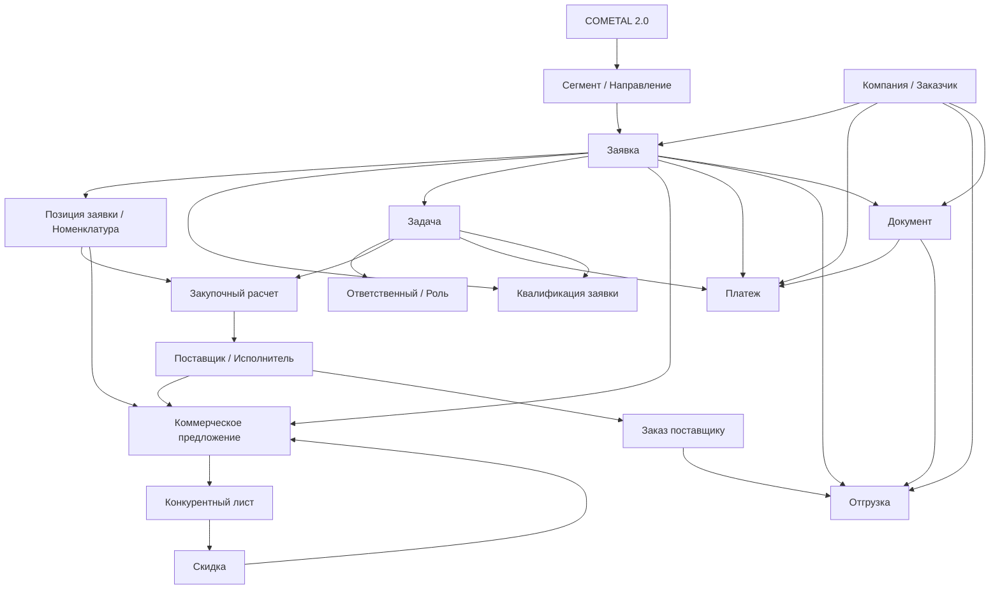

# Доменная архитектура COMETAL 2.0

Источник: https://www.figma.com/design/wt7rhRt3u2xq4t2ajUZ90R/COMETAL--2.0-18.06?m=auto&t=L9FxkjNzn3D3mWHi-6

Область анализа: только страницы из категорий `BUSINESS FLOWS` и `PRODUCT SCREENS` файла `02_file_map.md`.

Не анализировались: компоненты, дизайн-система, визуальный дизайн, архивные и экспериментальные страницы.

Основание: названия страниц, секций, фреймов и текстовые бизнес-маркеры, полученные через Figma MCP.

## Заявка

**Описание**

Центральная сущность системы. Заявка проходит регистрацию, заполнение, коммерческую квалификацию, техническую квалификацию, расчеты, согласование, работу с КП, оплатами и отгрузками.

**Связанные страницы**

- Заполнение заявки
- Коммерческая квалификация
- Техническая квалификация
- Задача на расчет закупки
- Запрос и расчёт скидки
- Конкурентный лист
- Металлотрейдинг
- Отвественные по заявке
- Экспорт план-факта платежей
- Карточка компании

**Связанные сущности**

- Компания / Заказчик
- Позиция заявки
- Задача
- Ответственный
- Коммерческое предложение
- Конкурентный лист
- Скидка
- Платеж
- Отгрузка
- Документ

**Связанные процессы**

- Заполнение карточки заявки
- Валидация обязательных полей
- Коммерческая квалификация
- Техническая квалификация
- Постановка задач на закупку и логистику
- Согласование заявки
- Формирование КП
- Экспорт план-факта платежей

## Компания / Заказчик

**Описание**

Сущность контрагента, вокруг которой собираются заявки, документы, отгрузки, оплаты, задачи и аналитическая информация. В Figma отдельно выделены карточка компании и блоки "О компании", "Мониторинг", "Связи", "Заявки", "Отгрузки", "Оплаты", "Документы".

**Связанные страницы**

- Карточка компании
- КАРТОЧКА КОМПАНИИ
- Отвественные по заявке
- Коммерческая квалификация
- Работа исполнителя с КП
- Страница "Отгрузки"

**Связанные сущности**

- Заявка
- Контакт / Ответственный
- Документ
- Платеж
- Отгрузка
- Коммерческое предложение

**Связанные процессы**

- Просмотр карточки компании
- Мониторинг компании
- Анализ маркеров компании
- Просмотр связанных заявок, документов, оплат и отгрузок

## Позиция заявки / Номенклатура

**Описание**

Единица состава заявки: товар, материал, деталь или позиция с количеством, ценой, параметрами закупки и данными для квалификации. В макетах встречаются поиск позиций в других заявках, номенклатура, количество в предложении, цена исполнителя.

**Связанные страницы**

- Заполнение заявки
- Коммерческая квалификация
- Техническая квалификация
- Задача на расчет закупки
- Металлотрейдинг
- Работа исполнителя с КП

**Связанные сущности**

- Заявка
- Коммерческое предложение
- Поставщик
- Закупочный расчет
- Конкурентный лист

**Связанные процессы**

- Заполнение позиций заявки
- Поиск позиций в прошлых/других заявках
- Валидация полей позиций
- Расчет закупочной цены
- Выбор позиции для КП

## Задача

**Описание**

Рабочая единица процесса. Через задачи распределяются квалификация, расчет закупки, расчет логистики, согласование, загрузка документов и действия по оплатам.

**Связанные страницы**

- Задачи
- Заполнение заявки
- Задача на расчет закупки
- Отвественные по заявке
- Канбан оплат
- Коммерческая квалификация
- Техническая квалификация

**Связанные сущности**

- Заявка
- Ответственный
- Исполнитель
- Закупщик
- Логист
- Платеж
- Документ

**Связанные процессы**

- Создание задачи
- Самоназначение ответственного
- Передача задачи в работу
- Согласование задачи
- Просрочка задачи
- Напоминания по задаче
- Закрытие задачи

## Ответственный / Роль

**Описание**

Участник процесса, назначенный на заявку или задачу. В макетах явно встречаются КАМ, закупщик, логист, исполнитель, бухгалтер, казначей, техэксперт и ответственные по заявке.

**Связанные страницы**

- Отвественные по заявке
- Задачи
- Задача на расчет закупки
- Техническая квалификация
- Канбан оплат
- Работа исполнителя с КП

**Связанные сущности**

- Заявка
- Задача
- Компания
- Закупочный расчет
- Платеж
- Коммерческое предложение

**Связанные процессы**

- Назначение ответственного
- Самоназначение
- Передача задачи между ролями
- Согласование результата работы
- Загрузка документов ответственным

## Квалификация заявки

**Описание**

Состояние и процесс проверки заявки. В файле выделены коммерческая и техническая квалификация, включая заполнение обязательных полей, проверку типа потребности, источника заявки и завершение квалификации.

**Связанные страницы**

- Коммерческая квалификация
- Техническая квалификация
- Заполнение заявки
- Задачи
- Металлотрейдинг

**Связанные сущности**

- Заявка
- Позиция заявки
- Ответственный
- Задача
- Коммерческое предложение

**Связанные процессы**

- Заполнение данных коммерческой квалификации
- Завершение коммерческой квалификации
- Самоназначение на техническую квалификацию
- Завершение технической квалификации
- Валидация полей квалификации

## Закупочный расчет

**Описание**

Сущность расчета закупки по заявке и позициям. В макетах описаны сценарии "через закупщика" и "самостоятельно", расчет закупочной цены, выбор поставщика и согласование результата.

**Связанные страницы**

- Задача на расчет закупки
- Металлотрейдинг
- Задачи
- Запрос и расчёт скидки

**Связанные сущности**

- Заявка
- Позиция заявки
- Задача
- Закупщик
- Поставщик
- Коммерческое предложение
- Скидка

**Связанные процессы**

- Постановка задачи на расчет закупки
- Получение задачи закупщиком
- Заполнение расчета закупки
- Согласование расчета
- Выбор поставщика

## Поставщик / Исполнитель

**Описание**

Контрагент, предоставляющий цену, сроки, КП или поставку по позициям заявки. В макетах встречаются поставщик, исполнитель, запрос исполнителю, КП исполнителя и выбор лучшего КП.

**Связанные страницы**

- Работа исполнителя с КП
- Металлотрейдинг
- Задача на расчет закупки
- Запрос и расчёт скидки

**Связанные сущности**

- Коммерческое предложение
- Позиция заявки
- Закупочный расчет
- Заказ поставщику
- Скидка

**Связанные процессы**

- Выбор поставщика
- Запрос коммерческого предложения
- Получение КП исполнителя
- Выбор лучшего КП
- Запрос скидки

## Коммерческое предложение

**Описание**

Предложение от исполнителя/поставщика или итоговое КП для заказчика. В макетах выделены запросы и КП исполнителей, сборное КП через конкурентный лист, КП заказчику на основе лучшего или теоретического КП.

**Связанные страницы**

- Работа исполнителя с КП
- Запрос и расчёт скидки
- Конкурентный лист
- Металлотрейдинг
- Карточка компании

**Связанные сущности**

- Заявка
- Компания / Заказчик
- Поставщик / Исполнитель
- Позиция заявки
- Конкурентный лист
- Скидка

**Связанные процессы**

- Наполнение запроса исполнителю
- Запрос КП
- Получение КП
- Просмотр КП от исполнителя
- Создание КП заказчику
- Просмотр КП заказчиком

## Конкурентный лист

**Описание**

Сущность сравнения предложений и формирования сборного КП. В макетах есть отдельный флоу заполнения конкурентного листа и процесс формирования сборного КП через него.

**Связанные страницы**

- Конкурентный лист
- Работа исполнителя с КП
- Запрос и расчёт скидки

**Связанные сущности**

- Коммерческое предложение
- Поставщик / Исполнитель
- Позиция заявки
- Заявка
- Скидка

**Связанные процессы**

- Заполнение конкурентного листа
- Сравнение КП
- Выбор лучшего КП
- Формирование сборного КП

## Скидка

**Описание**

Сущность запроса и расчета скидки в коммерческом процессе. Доступна на этапе после коммерческой квалификации, когда КП еще нет или требуется пересчет условий.

**Связанные страницы**

- Запрос и расчёт скидки
- Задача на расчет закупки
- Работа исполнителя с КП
- Конкурентный лист

**Связанные сущности**

- Заявка
- Коммерческое предложение
- Поставщик / Исполнитель
- Закупочный расчет
- Конкурентный лист

**Связанные процессы**

- Запрос скидки
- Расчет скидки
- Применение скидки к КП
- Согласование измененных условий

## Документ

**Описание**

Обобщенная сущность файлов и юридически/финансово значимых документов: счета, платежные поручения, первичная документация, УПД, СП, счет-договор, документы компании и заявки.

**Связанные страницы**

- Формирование документа СП / Счёт-договора и отправка на согласование
- Канбан оплат
- Импорт платежей
- Карточка компании
- КАРТОЧКА КОМПАНИИ
- Страница "Отгрузки"

**Связанные сущности**

- Заявка
- Компания
- Платеж
- Отгрузка
- Заказ поставщику

**Связанные процессы**

- Формирование СП / счета-договора
- Отправка документа на согласование
- Загрузка первичной документации
- Загрузка платежного поручения
- Прикрепление УПД для создания отгрузок

## Заказ поставщику

**Описание**

Сущность будущего или частично описанного процесса формирования и проверки заказа поставщику. Страница существует как бизнес-флоу в работе.

**Связанные страницы**

- Формирование и проверка Заказа поставщикам
- Задача на расчет закупки
- Металлотрейдинг

**Связанные сущности**

- Поставщик
- Заявка
- Позиция заявки
- Закупочный расчет
- Документ
- Отгрузка

**Связанные процессы**

- Формирование заказа поставщику
- Проверка заказа поставщику
- Передача заказа в дальнейшие закупочные и логистические процессы

## Платеж

**Описание**

Финансовая сущность системы. В макетах выделены канбан оплат, импорт платежей, ручное разнесение, исключение платежей, возврат в разнесение, экспорт план-факта, счета и платежные поручения.

**Связанные страницы**

- Канбан оплат
- Импорт платежей
- Экспорт план-факта платежей
- Карточка компании

**Связанные сущности**

- Заявка
- Компания
- Документ
- Задача
- Ответственный

**Связанные процессы**

- Получение счета
- Передача счета заказчику
- Оплата счета
- Загрузка платежного поручения
- Импорт платежей
- Ручное разнесение платежа
- Исключение платежа из разнесения
- Возврат платежа в очередь разнесения
- Экспорт план-факта платежей

## Отгрузка

**Описание**

Логистическая/операционная сущность, связанная с компанией, заявкой, документами и платежами. В макетах есть страница отгрузок, карточка отгрузки и сценарий создания отгрузки через УПД или вручную.

**Связанные страницы**

- Страница "Отгрузки"
- Карточка отгрузки - модальное окно
- Карточка компании

**Связанные сущности**

- Компания
- Заявка
- Документ
- Заказ поставщику
- Платеж

**Связанные процессы**

- Создание отгрузки вручную
- Создание отгрузки из УПД
- Просмотр карточки отгрузки
- Мониторинг отгрузок компании

## Сегмент / Направление

**Описание**

Классификатор заявки и бизнес-направления. В файле явно выделены направления Металлотрейдинг и Машиностроение, а в процессах встречается выбор сегмента заявки.

**Связанные страницы**

- МЕТАЛЛОТРЕЙДИНГ
- Металлотрейдинг
- МАШИНОСТРОЕНИЕ
- Задача на расчет закупки

**Связанные сущности**

- Заявка
- Позиция заявки
- Задача
- Закупочный расчет

**Связанные процессы**

- Выбор сегмента заявки
- Маршрутизация заявки по направлению
- Применение специфичных таблиц и сценариев направления

## SYSTEM MAP

